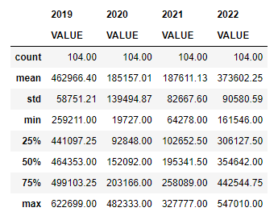
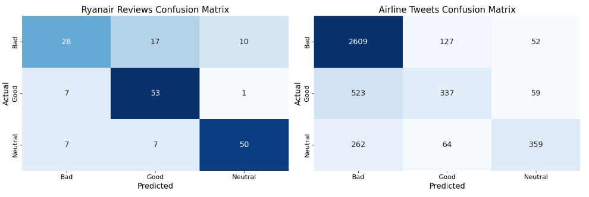
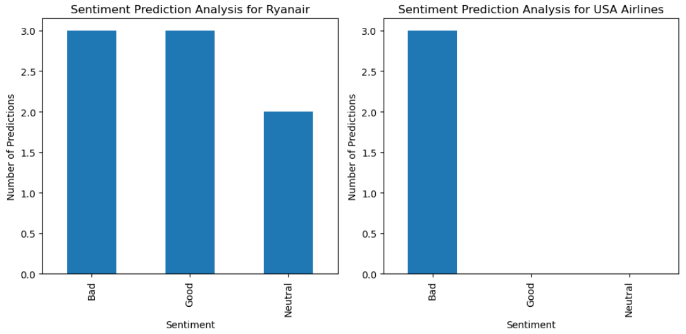
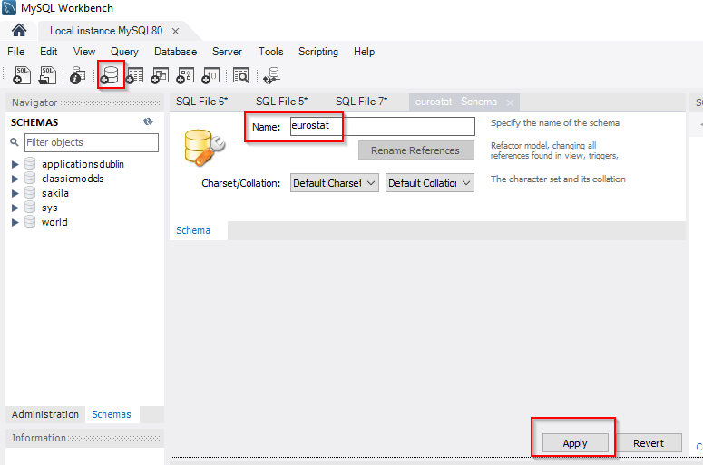
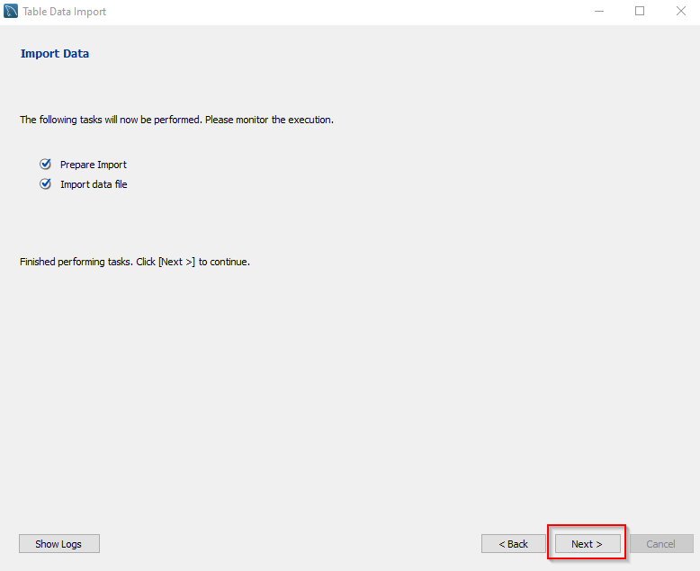
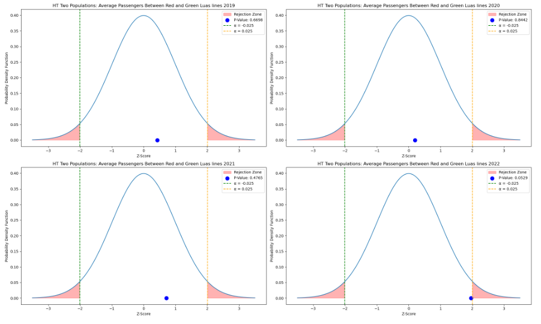
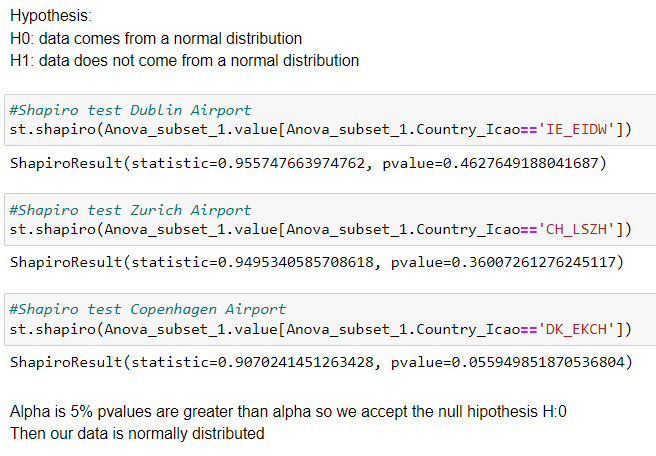
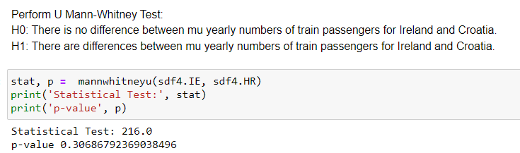
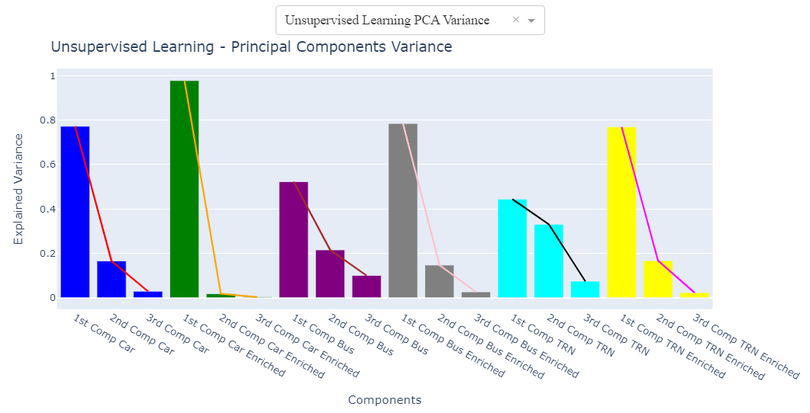

**CCT College Dublin Continuous Assessment**

**Learning Outcomes:**

Please note this is not the assessment task. The task to be completed is detailed on the next page.

This CA will assess student attainment of the following minimum intended learning outcomes:

**Programming for DA**

1. Critically appraise aggregation methods to process and manipulate data from multiple data structures. (Linked to PLO 4).

2. Formulate and evaluate a testing and optimisation strategy for programmatic solutions. (Linked to PLO 5).

3. Compare, contrast and select relevant libraries / techniques to process data from diverse sources. (Linked to PLO 5).

**Statistics for Data Analytics**

1. Formulate and test hypotheses using appropriate statistical techniques and evaluate and communicate the result effectively. (Linked to PLO 2, PLO 3, PLO6).

2. Utilise current software and language to produce the results of your analysis from existing data. (Linked to PLO 1, PLO 4).

3. Apply statistical analysis to appropriate datasets and critique the limitations of the model. (Linked to PLO 2, PLO4).

**Machine Learning for Data Analysis**

1.Modify and implement Machine Learning Algorithms to solve analytical problems. (Linked to

PLO 1, PLO 2, PLO 5)

3. Develop a machine learning strategy for a given domain and communicate effectively to team members, peers and project stakeholders the insight to be gained from the interpreted results. (Linked to PLO 1, PLO 4, PLO.

5. Formulate and evaluate a test and optimisation strategy for programmatic solutions. (Linked to PLO 5).

**Data Preparation & Visualisation**

1. Programmatically Implement graphical methods to identify issues within a data set (missing, out of range, dirty data)(linked to PLO 3, PLO 5)

2. Propose, design, develop, and implement an interactive data visualisation solution, for a given data set and potential audience,  detailing the rationale for approach and visualisation choices made during development for a given use case, data characteristics and multiple transmission media (linked to PLO 2, PLO 5)

3. Perform a critical analysis of a data set to optimise the data for a given problem space. Document the rationale behind the decisions to peers and stakeholders.(linked to PLO 5, PLO 6)

Attainment of the learning outcomes is the minimum requirement to achieve a Pass mark (40%). Higher marks are awarded where there is evidence of achievement beyond this, in accordance with QQI *Assessment and Standards, Revised 2013*, and summarised in the following table:

| Percentage Range | CCT Performance Description | QQI Description of Attainment  |
|---|---|---|
|  |  | Level 9 awards |
| 90% + | Exceptional | Achievement includes that required for a Pass and in most respects is significantly and consistently beyond this |
| 80 – 89% | Outstanding |  |
| 70 – 79% | Excellent |  |
| 60 – 69% | Very Good | Achievement includes that required for a Pass and in many respects is significantly beyond this |
| 50 – 59% | Good | Attains all the minimum intended programme learning outcomes   |
| 40 – 49%
 | Acceptable |  |
| 35 – 39% | Fail | Nearly (but not quite) attains the relevant minimum intended learning outcomes |
| 0 – 34% | Fail | Does not attain some or all of the minimum intended learning outcomes |

Please review the CCT Grade Descriptor available on the module Moodle page for a detailed description of the standard of work required for each grade band.

The grading system in CCT is the QQI percentage grading system and is in common use in higher education institutions in Ireland. The pass mark and thresholds for different grade bands may be different from what you have experienced in the higher education system in other countries. CCT grades must be considered in the context of the grading system in Irish higher education and not assumed to represent the same standard the percentage grade reflects when awarded in an international context.

_____________________________________________________________________________________

**Assessment Task**

Students are advised to review and adhere to the submission requirements documented after the assessment task.

***Scenario***

***Transport in Ireland***

*“Smartcard ticketing systems currently available in many cities’ public transport systems enable a vast amount of data.*

*These datasets reflect how people behave, which in turn means it is possible to assess their transport needs and provide an accurate picture of their habits, either as groups (based on fare types, such as student, elderly and so on) or at an individual level.*

*Thanks to big data analytics, we can adapt public transport to these needs, plan new services, minimise walking time and so on.”—* *https://www.engineersireland.ie/Brexit/big-data-enables-better-urban-transport-networks*

**You have been tasked with analysing Ireland's Transport data and comparing the Irish Transport sector with other countries (of your choosing) worldwide.** This analysis should also include forecasting, sentiment analysis and evidence-based recommendations for the sector as well as a complete rationale of the entire process used to discover your findings. Your Research could include vehicle traffic, type of vehicles used, freight transport, air traffic, transport infrastructure etc. (or any other relevant topic EXCEPT Climate change) with Ireland as your base line.

**Note:**

- **While topical, Construction impact on Climate Change SHOULD NOT be chosen as an area of research for this assessment.**

You must source appropriate data sets from any available repository (eg. But not restricted to https://data.gov.ie/organization/transport-infrastructure-ireland)  to inform your research (all datasets MUST be referenced and the relevant licence/permissions detailed).

***Criteria of Analysis***

Discuss the choice of project management framework you have deemed suitable for this project.

It is expected that you use some type of version control software eg: GitHub, Gitlab, BitBucket etc with regular commits of code and report versions. **Please include the address of your version control repository in your report.**

**Programming for DA Tasks ****[0-100]**

1. **Programming:** The project must be explored programmatically: this means that you must implement suitable Python tools (code and/or libraries) to complete the analysis required. All of this is to be implemented in a Jupyter Notebook. **[0-20]**

2. **Data structures:** You are required to gather and process data that has been stored in at least two distinct formats. For example, this can be data in a CSV file, from a MySQL database or from a web API in JSON format.** [0-20]**

3. **Documentation:** The project documentation must include sound justifications and explanation of your code choices. Code quality standards should also be applied. **[0-20]**

4. **Testing & Optimisation:** You are required to document and evaluate a testing and optimisation strategy for your analysis. As part of this, you may want to plan and document how you ensured your code is doing what it is meant to, as well as ensuring that the code is making good use of your resources (eg computing, time etc). Note any trade-offs that you've made in these areas. **[0-20]**

5. **Data manipulation:** For each of the different data sources, compare and contrast at least two relevant libraries and techniques for a) processing and b) aggregating the respective data, in order to justify your chosen libraries/techniques. **[0-20]**

**Total Mark = 20+20+20+20+20=100**

**Statistics for Data Analytics Tasks**

- Use descriptive statistics and appropriate visualisations in order to summarise the dataset(s) used, and to help justify the chosen models. **[0-20]**

- Analyse the variables in your dataset(s) and use appropriate inferential statistics to gain insights on possible population values (e.g., if you were working with public transport, you could find a confidence interval for the population proportion of users commuting to Dublin by train). **[0-20]**

- Undertake research to find similarities between some country(s) against Ireland and apply parametric and non-parametric inferential statistical techniques to compare them (e.g., t-test, analysis of variance, Wilcoxon test, chi-squared test, among others). You must justify your choices and verify the applicability of the tests. Hypotheses and conclusions must be clearly stated. You are expected to use at least 5 different inferential statistics tests. **[0-40]**

- Use the outcome of your analysis to deepen your research. Indicate the challenges you faced in the process. **[0-20]**

*Note: All your calculations and reasoning behind your models must be documented in the report and/or the appendix.*

**Total Mark = 20+20+40+20=100**

**Machine Learning Tasks**

Use of multiple models (at least two) to compare and contrast results and insights gained.

- Describe the rationale and justification for the choice of machine learning models for the above-mentioned scenario. Machine Learning models can be used for Prediction, Classification, Clustering, sentiment analysis, recommendation systems and Time series analysis. You should plan on trying multiple approaches (at least two) with proper selection of hyperparameters using GridSearchCV method. You can choose appropriate features from the datasets and a target feature to answer the question asked in the scenario in the case of supervised learning.

**[0 - 30]**

- Collect and develop a dataset based on the transport topic related to Ireland as well as other parts of the world. Perform a sentimental analysis for an appropriate transport topic (e.g., public transport, freight movement etc…) for producers and consumers point of view in Ireland.

**[0 - 25]**

- You should train and test for Supervised Learning and other appropriate metrics for unsupervised/ semi-supervised machine learning models that you have chosen. Use cross validation to provide authenticity of the modelling outcomes. You can apply dimensionality reduction methods to prepare the dataset based on your machine learning modelling requirements.

**[0 - 30]**

- A Table or graphics should be provided to illustrate the similarities and contrast of the Machine Learning modelling outcomes based on the scoring metric used for the analysis of the above-mentioned scenario. Discuss and elaborate your understanding clearly.

**[0 - 15]**

**Total Mark = 30+25+30+15=100**

**Data Preparation & Visualisation Tasks**

- Discuss in detail the process of acquiring your raw data, detailing the positive and/or negative aspects of your research and acquisition. This should include the relevance and implications of any and all licensing/permissions associated with the data. **[0-15]**

- Exploratory Data Analysis helps to identify patterns, inconsistencies, anomalies, missing data, and other attributes and issues in data sets so problems can be addressed. Evaluate your raw data and detail, in depth, the various attributes and issues that you find. Your evaluation should reference evidence to support your  chosen methodology and use visualizations to illustrate your findings.**[0-25]**

- Taking into consideration the tasks required in the machine learning section, use appropriate data cleaning, engineering, extraction and/or other techniques to structure and enrich your data. Rationalize your decisions and implementation, including evidence of how your process has addressed the problems identified in the EDA (Exploratory Data Analysis) stage and how your structured data will assist in the analysis stage. This should include visualizations to illustrate your work and evidence to support your methodology.**[0-30**]

- Modern Transport planning has a great dependence on technology and relies upon visualizations to communicate information, this includes web based, mobile based and many other digital transmission formats. Develop an interactive dashboard tailored to modern Transport planning, using tufts principles, to showcase the information/evidence gathered following your Machine Learning Analysis. Detail the rationale for approach and visualisation choices made during development. **Note you may not use Powerbi, rapidminer, tableau or other such tools to accomplish this (at this stage).[0-30]**

**Total Mark = 15+25+30+30=100**

**Marks and feedback will be provided for each module separately based upon the learning outcomes for each of the modules.**

**All documentation, code, examples, and any other files MUST be evidenced in your Version Control repository. (Git or Similar) using your CCT email address ONLY. Your repository MUST show your continual development of the project throughout its lifecycle and include notes detailing progress at each commit.**

**You may be called to a Viva to defend your work.**

**Additional notes :**

All:

- Your documentation should present your approach to the project, including elements of project planning ( timelines).

- Ensure that your documentation follows a logical sequence through the planning / research / justification / implementation phases of the project.

- Ensure that your final upload contains a** maximum of 1 jupyter notebook per module.**

- Please ensure that additional resources are placed and linked to a logical file structure eg, Scripts, Images, Report, Data etc…

- Ensure that you include your raw and structured datasets in your submission

- 3000(+/- 10%) words in report (not including code, code comments, titles, references, or citations)

- Your Word count MUST be included

**(it is expected that research be carried out beyond class material)**

**Submission Requirements **All assessment submissions must meet the minimum requirements listed below. Failure to do so may have implications for the mark awarded.  

**Submissions that are suspected of plagiarism and/or inclusion of AI (CHATGPT, BARD etc…) Generated content will be referred to the college authorities.**

All assessment submissions must:

- Jupyter Notebook (.ipynb), Word Document ONLY, Dashboard, and version control address

- Be submitted by the deadline date specified or be subject to late submission penalties

- Be submitted via Moodle upload

- Use [Harvard Referencing](http://40.115.124.2/sp/subjects/guide.php?subject=harvardref) when citing third party material 

- Be the student’s own work.

- Include the CCT assessment cover page.

**Additional Information**

- Lecturers are not required to review draft assessment submissions. This may be offered at the lecturer’s discretion.

- In accordance with CCT policy, feedback to learners may be provided in written, audio or video format and can be provided as individual learner feedback, small group feedback or whole class feedback.

- Results and feedback will only be issued when assessments have been marked and moderated / reviewed by a second examiner.

- Additional feedback may be requested by *contacting Your Lecturer,* Additional feedback may be provided as individual, small group or whole class feedback. Lecturers are not obliged to respond to email requests for additional feedback where this is not the specified process or to respond to further requests for feedback following the additional feedback. 

- Following receipt of feedback, where a student believes there has been an error in the marks or feedback received, they should avail of the recheck and review process and should not attempt to get a revised mark / feedback by directly approaching the lecturer. Lecturers are not authorised to amend published marks outside of the recheck and review process or the Board of Examiners process.

- Students are advised that disagreement with an academic judgement is not grounds for review.

- For additional support with academic writing and referencing students are advised to contact the CCT Library Service or access the [CCT Learning Space](http://learningspace.cct.ie/subjects/index.php).

- For additional support with subject matter content students are advised to contact the [CCT Student Mentoring Academy](https://moodle.cct.ie/mod/forum/view.php?id=55148)

- For additional support with IT subject content, students are advised to access the [CCT Support Hub](https://moodle.cct.ie/course/view.php?id=1861).

__________________________________________________________________________________________________________________________________________________________________________

# Commencement of Second Assignment for Semester One
__________________________________________________________________________________________________________________________________________________________________________

# Title
**Analysis of the Irish Transport Sector: A Comparative Study with EU Countries**

# Details

**MSc in Data Analytics (SB+) - Sept 2023 - 2024 - YR1**

Author: Jose Maria Rico Leal

e-mail: sba23021@student.cct.ie

Student ID: sba23021

GitHub Link:
https://github.com/JoseRicoCct/CA2_Integrated_Assesment_MSc_Data_Analytics_CCT_Semester_1.git

## **Abstract**

*This paper compares some key areas of the Republic of Ireland transportation sector with \
some European Countries. The study employs, statistical analysis, machine learning and data \
visualisation. We completed the research through programming, testing, optimization, and \
sentiment analysis. Results highlight the sector\'s performance, challenges faced, and offer \
insights for future research. The combination of rigorous statistical techniques and machine \
learning enhances the understanding of Ireland\'s transport landscape, contributing valuable \
perspectives for policy and industry stakeholders.*

# Index

- [Abstract](#abstract)
- [1. Introduction](#1-introduction)
- [2. Programming](#2-programming)
  - [2.1. Programming](#21-programming)
  - [2.2. Data Structures](#22-data-structures)
  - [2.3. Documentation](#23-documentation)
  - [2.4. Testing and Optimization](#24-testing-and-optimization)
    - [2.4.1. Testing](#241-testing)
    - [2.4.2. Optimization](#242-optimization)
  - [2.5. Data Manipulation](#25-data-manipulation)
- [3. Statistical Analysis](#3-statistical-analysis)
  - [3.1. Descriptive Statistics](#31-descriptive-statistics)
    - [3.1.1. Dataset for Confidence Interval](#311-dataset-for-confidence-interval)
    - [3.1.2. Dataset for Hypothesis Test Two Populations](#312-dataset-for-hypothesis-test-two-populations)
    - [3.1.3. Dataset for ANOVA One-Way](#313-dataset-for-anova-one-way)
    - [3.1.4. Dataset for Chi-Squared Test](#314-dataset-for-chi-squared-test)
    - [3.1.5. Dataset for Kruskal-Wallis](#315-dataset-for-kruskal-wallis)
    - [3.1.6. Dataset for U-Mann Whitney](#316-dataset-for-u-mann-whitney)
  - [3.2. Confidence Interval](#32-confidence-interval)
  - [3.3. Inferential Statistics](#33-inferential-statistics)
    - [3.3.1. Parametric](#331-parametric)
      - [3.3.1.1. T-test Two Populations](#3311-t-test-two-populations)
      - [3.3.1.2. ANOVA One-Way](#3312-anova-one-way)
      - [3.3.1.3. Chi-squared test](#3313-chi-squared-test)
    - [3.3.2. Non-parametric](#332-non-parametric)
      - [3.3.2.1. Kruskal-Wallis](#3321-kruskal-wallis)
      - [3.3.2.2. U-Mann Whitman](#3322-u-mann-whitman)
  - [3.4. Further Research and Challenges Faced](#34-further-research-and-challenges-faced)
- [4. ML](#4-ml)
  - [4.1. Supervised Learning](#41-supervised-learning)
  - [4.2. Cross Validation and Feature Reduction](#42-cross-validation-and-feature-reduction)
  - [4.3. Unsupervised Learning](#43-unsupervised-learning)
  - [4.4. Sentiment Analysis](#44-sentiment-analysis)
  - [4.5. Table and Conclusions](#45-table-and-conclusions)
    - [4.5.1. Supervised Learning](#451-supervised-learning)
    - [4.5.2. Cross Validation and Feature Reduction](#452-cross-validation-and-feature-reduction)
    - [4.5.3. Unsupervised Learning](#453-unsupervised-learning)
- [5. Data Preparation and Visualization](#5-data-preparation-and-visualization)
  - [5.1. Data acquisition](#51-data-acquisition)
  - [5.2. EDA methodology](#52-eda-methodology)
  - [5.3. EDA ML implementation](#53-eda-ml-implementation)
  - [5.4. Dashboard](#54-dashboard)
- [6. Conclusion](#6-conclusion)
- [7. References](#7-references)
- [8. Annex](#8-annex)
  - [8.1. Programming](#81-programming)
    - [8.1.1. MySQL Setup](#811-mysql-setup)
    - [8.1.2. Testing and Optimization](#812-testing-and-optimization)
  - [8.2. Statistics](#82-statistics)
  - [8.3. Data Visualization](#83-data-visualization)
    - [8.3.1. EDA Methodology](#831-eda-methodology)
    - [8.3.2. EDA ML implementation](#832-eda-ml-implementation)
    - [8.3.3. Dashboard](#833-dashboard)
- [9. License](#9-license)

## 1. Introduction

In this assignment, we deep dive into some aspects of the Irish transport sector, conducting a multifaceted analysis that extends to various key dimensions. With a specific focus on programming, statistical analysis, machine learning, and data visualization, our examination goes beyond the surface, comparing Ireland's transport landscape with selected EU nations. By employing a diverse array of methodologies, we aim to provide clarity in some of the aspects of the sector's strengths, challenges, and opportunities for improvement. This introduction sets the stage for a thorough exploration, offering valuable insights into the complex interplay of factors shaping the Irish transport sector within the broader European context.

## 2. Programming

### 2.1. Programming

I organized the project into five Jupyter Notebooks:\
CA2_ML_Code.ipynb, CA2_Programming_Code.ipynb, CA2_Statistics_Code.ipynb and CA2_Data_Visualisation.ipynb. The project is programmatically explored using Python, emphasizing modularity and narrative-style programming.

### 2.2. Data Structures

For this project I gathered and processed data from:

CSV file:

Figure 1

Web API in CSV format:

Figure 2

Eurostat module:

Figure 3

Also, I explored gathering data from a:

Web API in JSON format:

Figure 4

The entire parsing process is documented in "CA2_Programming_Code_sba23021.ipynb" from cell 8 to 17 (Goel, 2020).

MySQL database:

Figure 5

As I could not find an open MySQL database to connect, I will be demonstrating how to extract data from a local MySQL database. I created a table named "tran_hv_psmod" within a schema called "eurostat" and imported the previously fetched file from Eurostat, "TRAN_HV_PSMOD.csv":

Figure 6

Once I had the records in the table, I was able to retrieve them using the Python package "sqlalchemy" (Oyama, 2022):

Figure 7

Complete instructions on creating the table, pushing, and fetching records are provided in the annex (8.1. MySQL Setup) (dev.mysql.com, n.d.).

### 2.3. Documentation

In terms of documentation, I endeavoured to provide comments explaining the rationale behind each line of code. This includes details about the purpose of each line and the workflow for data manipulation and visualization.

I maintained code quality standards by adhering to the "PEP 8" styling guidelines (van Rossum, Warsaw and Coghlan, 2001). Given the project's nature, which primarily involves data manipulation and visualization, there was no need for the introduction of complex programming constructs or advanced "OOP" principles. My objective was to ensure clean and modularized code.

### 2.4. Testing and Optimization

#### 2.4.1. Testing

I have conducted extensive testing in the statistical section, examining each scenario to ensure the statistical model fits appropriately. Furthermore, I refined the testing process when accepting the null hypothesis. All statistical models in "CA2_Statistics_Code_sba23021.ipynb" are implemented after thorough testing.\
Now, we are going to explore a testing example for a hypothesis test involving two populations.

This table will help us formulate the hypothesis:

Figure 8

H0: mu IE_BUS = mu EU_Country_BUS; There is no significant difference between the percentage average on passenger-kilometres for Vehicle BUS in Ireland and EU_Country.

H1: mu IE_BUS != mu EU_Country_BUS; There is a significant difference between the percentage average on passenger-kilometres for Vehicle BUS in Ireland and EU_Country.

Let us start the testing and choose Italy to determine whether we accept or reject the null hypothesis:

Figure 9

Figure 10

We can clearly see that H0 is rejected therefore there is a significant difference in the average percentage of BUS passengers between Ireland and Italy.

Now we are going to select Slovenia as its mu is closer to the Irish one:

Figure 11

Figure 12

We accept H0 and conclude that there is not enough evidence to say that there is a significant difference between the percentage average on passenger-kilometres for vehicle BUS in Ireland and Slovenia.

There is another testing scenario in annex 8.1.2.

#### 2.4.2. Optimization

Good examples of optimization can be found in "CA2_ML_Code_sba23021.ipynb", where I enriched the datasets to achieve better accuracy in machine learning models.

I observed a low accuracy of 69.23% for SVC and the best score at 90.88% (C: 1000, Gamma=0.01). I identified that the model was not fitting properly at Gamma = 0.0001.

After enriching the dataset, I achieved an accuracy of 87.01% for SVC, with the best score at 91.88% (C: 1000, Gamma=0.001). The results indicate a less overfitted model as the best score is obtained at a higher Gamma. Additionally, the graph at Gamma=0.0001 shows that the test and train sets are more fitted after enrichment.\
In the annex 8.1.2 we can find other two scenarios for optimization.

Figure 13

### 2.5. Data Manipulation

In analyzing different data sources, I utilized various libraries and techniques for both processing and aggregating data (GeeksforGeeks, 2020). The comparisons and contrasts for each data source are summarized in Figure X, and the detailed implementation and explanation of the code can be found in "CA2_Programming_Code_sba23021.ipynb."

Figure 14

## 3. Statistical Analysis

### 3.1. Descriptive Statistics

#### 3.1.1. Dataset for Confidence Interval

Dataset used is "tii03-passenger-journeys-by-luas". We aim to estimate the range of potential values for the parameter "LUAS average passenger number".\
Below are the descriptive statistics for the total LUAS passenger numbers (green and red lines) for the years 2019, 2020, 2021 and 2022:

Figure 15

We will be examining the mean values to establish the confidence intervals.\
It is interesting to note that both lines are quite balanced in terms of usage.

Figure 16

In Section 3.2, a detailed analysis of confidence intervals will be conducted for this dataset.

#### 3.1.2. Dataset for Hypothesis Test Two Populations

In this section we are comparing Ireland with some European countries, formulating hypothesis to assess if there are statistically significant differences in the "percentage average passenger-kilometres based on type of transport (Bus, Car and Train".\
Since we will be using Ireland mean against other countries mean, this plot will assist us in constructing the hypothesis:

Figure 17

The dataset used is "Modal split of inland passenger transport" with the Eurostat code "TRAN_HV_PSMOD."

#### 3.1.3. Dataset for ANOVA One-Way

Using Irish airports as a reference, an ANOVA will be conducted to test whether there are any statistically significant differences in the means compared to other European airports. The dataset used is "Air passenger transport by main airports in each reporting country" with the Eurostat code "AVIA_PAOA."

In the first scenario Dublin Airport is considered, and below a graph of the subset of airports selected for this case:

Figure 18

In the second scenario, Shannon Airport is considered, and below is a graph showing the subset of airports selected for this case:

Figure 19

#### 3.1.4. Dataset for Chi-Squared Test

This test will be performed to examine the association between the categorical variable "Motor_energy_type" for Ireland and Austria. The dataset used is "New passenger cars by type of motor energy" with the Eurostat code "road_eqr_carpda."

This model is highly sensitive to the frequency of the variables. I have presented two cases: one where we reject H0, and the second one where I manually changed values to accept H0. I will now illustrate how the categorical variable numbers will look for each case, with further analysis to follow in "3.3.1.3. Chi-squared test."

Scenario 1: Rejecting H0.

Figure 20

Scenario 2: Accepting H0.

Figure 21

#### 3.1.5. Dataset for Kruskal-Wallis

For this test, I utilized the same dataset as for ANOVA. Some of the airports violated the assumptions of normality required for ANOVA. The advantage of using the Kruskal-Wallis test is that it does not require normality to perform the test. I will present two scenarios: one to accept H0 and another to reject H0.

Scenario 1: Accepting H0.

Figure 22

Scenario 2: Rejecting H0.

Figure 23

#### 3.1.6. Dataset for U-Mann Whitney

I used a new dataset for this test, "Passengers transported (Railway transport)", with the Eurostat code "rail_pa_total" because the data did not follow a normal distribution. This choice allowed me to demonstrate the test's capability to handle non-normally distributed data.

Scenario 1: Accepting H0.

Figure 24

Scenario 2: Rejecting H0.

Figure 25

### 3.2. Confidence Interval

The task is to determine the weekly LUAS average for the total number of passengers in the years 2019, 2020, 2021, and 2022. It is important to note that both LUAS lines (red and green) are in scope. The analysis will be conducted with a 90% confidence level, and here are the results:

Figure 26

E.g. At a 90% confidence level, for 2019 the weekly LUAS number of passengers average is between 453K and 472K. Subsequently the same formulation for the rest of the years.

Plotting the confidence intervals:

Figure 27

After performing confidence intervals, the next natural step is to verify if the weekly averages are the same for both the red and green LUAS lines. We will use a t-test (www.statisticslectures.com, n.d.).

Figure 28

Hypothesis:

H0: μ green line = μ red line.\
H1: μ green line != μ red line.

Results:

Figure 29

Figure 30

At a 5% significance level, we accept the Null Hypothesis; there is not enough evidence to conclude that the weekly mean values for the LUAS green line are different from those of the red line.

### 3.3. Inferential Statistics

#### 3.3.1. Parametric

##### 3.3.1.1. T-test Two Populations

To perform this test, we will compare Ireland with three different countries, each having a distinct transportation method. The first scenario involves comparing Ireland with Slovenia for cars, the second compares Ireland with Denmark for buses, and the third compares Ireland with Slovenia again, but this time for trains.

Hypothesis:

H0: μ Ireland = μ EU Country.

H1: μ Ireland != μ EU Country.

Results:

Figure 31

Since the p-value is greater than alpha, we accept the null hypothesis (H0). There is not enough evidence to conclude that there is a significant difference between the percentage average of passenger-kilometres for the BUS vehicle in Ireland and Slovenia.

Figure 32

As the p-value is less than alpha, we reject the null hypothesis (H0), providing sufficient evidence to conclude a significant difference in the percentage average of passenger-kilometres for the Car vehicle between Ireland and Denmark.

Figure 33

As the p-value is less than alpha, we reject the null hypothesis (H0), indicating sufficient evidence to conclude a significant difference in the percentage average of passenger-kilometres for the Train vehicle between Ireland and Slovenia.

Figure 34

##### 3.3.1.2. ANOVA One-Way

In the first scenario, we examine Dublin, Zurich, and Copenhagen airports to verify whether the yearly average passenger numbers for the period from 2003 to 2022 are the same or not (Laerd Statistics, 2018).

To perform ANOVA, we need both Shapiro-Wilk and Levene tests to have p-values greater than 5% alpha.

Figure 35

Now we can perform ANOVA:

H0: μ IE_EIDW = μ CH_LSZH = μ DK_EKCH.

H1: there are at least 2 μ that are different one to another.

Result p-value = 0.889

Figure 36

There is no reason to reject the Null Hypothesis; therefore, we can conclude that, with a 5% alpha, the mean of annual passengers carried (2003-2022) for Dublin, Zurich and Copenhagen airports is quite similar.

Second scenario: Shannon, Billund, and Treviso airports. We want to verify if the yearly average passenger numbers for the period 2003 to 2022 are the same or not.

Shapiro-Wilk and Levene tests:

Figure 37

ANOVA hypothesis:

H0: μ IE_EINN= μ IT_LIPH= μ DK_EKBI.

H1: there are at least 2 μ that are different one to another.

Result p-value = 0.04

Figure 38

We fail to accept the Null Hypothesis; therefore, we can state that with a 5% alpha the mean of annual passengers carried (2003-2022) for Shannon, Treviso-Sant'Angelo and Billund airports is different.

##### 3.3.1.3. Chi-squared test

First Scenario:

Hypothesis:

H0: There is no significant difference between the observed and expected frequencies. Ireland and Austria are independent with no association or relationship.

Figure 39

H1: There is a significant difference between the observed and expected frequencies, indicating a non-independent relationship between Ireland and Austria

Result p-value = 1.64e-14, we fail to accept H0.

Figure 40

In the second scenario, I manually adjusted values for Austria to align frequencies more closely with those of Ireland; this model is highly sensitive to substantial differences between categorical variables.

Figure 41

After applying the Chi-Square test, we obtained a p-value of 0.59, leading us to accept H0.

Figure 42

#### 3.3.2. Non-parametric

##### 3.3.2.1. Kruskal-Wallis

Scenario 1:

We do not have normality for our samples (Xia, 2020):

Figure 43

Hypothesis:

H0: μ IE_EIKN= μ FR_LFBP= μ SE_ESGP.

H1: there are at least 2 μ that are different one to another.

Result, p-value = 0.23511.

Figure 44

We accept H0; the means of annual passengers carried (2003-2022) for Ireland West Knock, Pau Pyrenees, and Goteborg airports are quite similar.

Scenario 2:

We do not have normality for our samples:

Figure 45

Hypothesis:

H0: μ IE_EIKY= μ DE_EDSB= μ PL_EPRZ.

H1: there are at least 2 μ that are different one to another.

Result, p-value = 8.48e-08

Figure 46

We fail to accept H0; the means of annual passengers carried (2003-2022) for Kerry, Karlsruhe/Baden, and Rzeszow-Jasionka airports are different.

##### 3.3.2.2. U-Mann Whitman

Scenario 1:

Checking normality:

Figure 47

Hypothesis:

H0: μ Ireland = μ Croatia.

H1: μ Ireland != μ Croatia.

Result p-value = 0.3068

Figure 48

As the p-value is greater than alpha, we accept H0, indicating that there is no significant difference between the average number of train passengers in Ireland and Croatia.

Scenario 2:

Checking normality:

Figure 49

Hypothesis:

H0: μ Ireland = μ Slovakia.

H1: μ Ireland != μ Slovakia.

Result p-value = 3.45e-06

Figure 50

We reject H0 as p-value is lower than alpha, there is a significant difference between the average number of train passengers between Ireland and Slovakia.

### 3.4. Further Research and Challenges Faced

The tests I have conducted above reveal interesting findings:

"Number of public transport journeys at highest level since the beginning of the pandemic" (BreakingNews.ie, 2022), based on the confidence intervals, we can confirm that the number of passengers is recovering:

Figure 51

"Paris Charles De Gaulle recorded the highest number of air passengers" (ec.europa.eu, n.d.). "Dublin Airport Was EU's 11th Largest Airport in 2018" (DublinAirport, n.d.):

Figure 52

Analysing means in the ANOVA section we can see that those headings are highly correlated with "FR_LFPG" and "IE_EIDW."

The challenges faced included gathering the data and establishing the scenarios to perform the tests.

## 4. ML

### 4.1. Supervised Learning

The choice of the dataset "TRAN_HV_PSMOD" and the selection of supervised ML models (Decision Tree, Random Forest, K-Nearest Neighbours, and Support Vector Machine) are purely matters of modelling. After numerous attempts, this combination has proven effective (Thanh Noi and Kappas, 2017).

We will be modelling the dataset to see how models react having these classes:

Figure 54

I paired Ireland with Hungary because it showed the best performance association for selected ML models, here are the results:

Figure 55

Overall model is performing well however for Gamma = 0.0001, models seem to be overfitted (Kilic, 2023) as this score is lower compared to Gamma 0.01 and 0.001:

Figure 56

To address the issue of overfitting (Ghosh, 2023), I enriched the dataset by quarterly weighting yearly values:

Figure 57

Figure 58

The results are as follows:

Figure 59

Figure 60

Now we have a better fit, with higher scores observed at Gamma = 0.0001.

### 4.2. Cross Validation and Feature Reduction

Ireland will be our target variable for each transportation method. In the first attempt with yearly data, we obtained the following results:

Figure 61

After quarterly enrichment, increasing the number of rows from 32 to 128, we obtained the following results:

Figure 62

Linear regression estimation has performed much better with enriched data.

### 4.3. Unsupervised Learning

Dataset it is split into each mode of transportation having Ireland as a reference.

First attempt with quarterly data we get the following results:

Figure 63

Figure 64

To improve the results, we are going to enhance the dataset by breaking down each year into monthly values. The results are as follows:

Figure 65

Figure 66

KMeans and PCA have performed better with more data (L, 2020).

### 4.4. Sentiment Analysis

We are going to conduct sentiment analysis using Ryanair reviews and a set of tweets related to USA airlines. Results:

Figure 67

Tweets dataset is larger than Ryanair one that explains more correctly classified inputs:

Figure 68

Figure 69

Model accuracy for Ryanair is 73% and 75% for USA Airlines. ROC results as it follows:

Figure 70

USA Airlines seem to be classifying bad inputs better, while the other two are closer to each other. Let us test the classifier by adding reviews:

Figure 71

Result:

Figure 72

Ryanair's sentiment analysis performs well even though it has fewer inputs than USA Airlines. This difference could be attributed to the collection of reviews from Tripadvisor, where I ensured capturing opinions across good, bad, and neutral categories.

### 4.5. Table and Conclusions

#### 4.5.1. Supervised Learning

Let us compare each model after enriching the dataset.

Decision Trees CM:

Figure 73

Random Forrest:

Figure 74

KNN:

Figure 75

GridSearchCV CM:

Figure 76

Gamma Accuracy:

Figure 77

Accuracy Table:

Figure 78

By adding more values, models have performed better, with the exception of RF. However, we solved overfitting in the hyperparameter tuning phase, achieving higher accuracy at a lower level of gamma.

#### 4.5.2. Cross Validation and Feature Reduction

Same approach as we followed previously, we increased dataset row count by breaking down years into quarters, here the results:

Figure 79

Summary table:

Figure 80

Optimal feature selection and improved accuracy after enriching the dataset, undoubtedly, this method requires a larger dataset to perform well.

#### 4.5.3. Unsupervised Learning

PCA Variance:

Figure 81

PCA Scatter Plot:

Figure 82

PCA Heatmap:

Figure 83

Elbow Method:

Figure 84

Silhouette Score:

Figure 85

Tables PCA and Silhouette Score:

Figure 86

Figure 87

After enriching the data, the first principal component explains almost 97% of the variability for the CAR and BUS datasets, while the TRN dataset exhibits 76.86% variability on the first component. This demonstrates a clear improvement.\
The silhouette score has improved, indicating that the clusters are now closer to being well-defined (closer to +1). Additionally, all plots demonstrate a clear improvement after enlarging the dataset.

## 5. Data Preparation and Visualization

### 5.1. Data acquisition

Undoubtedly, this was the most challenging part of the assignment. However, I discovered the Eurostat website, which provides extensive content on data transportation. Additionally, the CSO offers interesting datasets related to the Irish transportation sector. Other platforms utilized included GitHub, Kaggle, and TripAdvisor.

A positive aspect of this research is that I discovered platforms such as Eurostat, which even has a Python package to download its datasets. On the negative side, the length of transportation datasets I found was a challenge for the machine learning part. There was not enough data to create accurate and consistent models. However, I found a solution to overcome this issue.

In terms of licenses, we are mostly covered by Creative Commons, allowing us to use these datasets. Only for Tripadvisor Ryanair reviews, I do not have licenses. After thorough research, I believe I am not infringing any law, as I am not collecting any personal data. I am compliant with GDPR (Your Europe, 2019), and Tripadvisor does not state that you cannot collect their reviews for research purposes.

Figure 88

### 5.2. EDA methodology

One of the issues was that Eurostat uses its nomenclature, and each dataset needed to be crosschecked to obtain accurate numbers. However, the main challenge was adapting datasets for the statistical models. EDA for this section can be found in "CA2_Data_Visualisation_Code_sba23021.ipynb" and some explanation in the annex (8.3.1). Nevertheless, EDA is also prevalent throughout the entire assignment. Here is a summary of the EDA performed:

Figure 89

### 5.3. EDA ML implementation

For ML I utilized "TRAN_HV_PSMOD" due to the versatility this dataset provides for modeling both supervised and unsupervised learning, as well as for cross-validation and feature reduction. Additionally, the dataset enabled a comparison of Ireland's modal split transport with that of other European countries.

The challenge lay in improving accuracy. The solution involved breaking down years into quarters for both supervised and cross-validation/feature reduction. For unsupervised learning, I subdivided years into months to leverage the increased data availability. Undoubtedly, the models performed better with the additional data.

#### Quarterly enrichment:

#### Monthly enrichment:

All EDA for ML can be seen in "CA2_ML_Code_sba23021.ipynb". I also created a more concise version "CA2_Data_Visualisation_Code_sba23021.ipynb", which emphasizes the relevant aspects of the EDA. Additional information is available in the annex (8.3.2).

### 5.4. Dashboard

The rationale and visualization choices can be seen in the table below, as follows:

As mentioned above I developed a dashboard in "CA2_Data_Visualisation_Code_sba23021.ipynb" outlining the relevant results for ML models. To comply with point "Modern Transport planning has a great dependence... web based" I adapted the dashboard to a streamlit (Parker, 2023) web dashboard. You can visit it at: <https://datavisualisationmoderntransportdashstudentsba23021.streamlit.app/>.

"CA2_Data_Visualisation_Code_sba23021.ipynb" dashboard:

Streamlit dashboard:

Complete dashboards can also be viewed in the annex (8.3.3).

## 6. Conclusion

In conclusion, the assignment most formidable phase involved the collection and adaptation of data for diverse methodologies. While my findings may not offer a panacea for the challenges faced by the Irish Transportation sector, I am confident that the statistical tests and Machine Learning models employed are presented in an accessible and pragmatic manner. This journey underscored the intricacies of data integration and analysis, highlighting the importance of methodological clarity. As I reflect on the complexities encountered, I recognize that this study contributes to a nuanced understanding of the sector. While not providing all-encompassing solutions, it lays the groundwork for informed discussions and potential pathways toward addressing the intricacies of the Irish Transportation landscape. I believe that the transparent modeling and interpretability fostered in this study pave the way for future endeavors in unraveling the challenges inherent in the field of transportation.

Word Count: 3,297 words

## 7. References

**Programming:**

Goel, A. (2020). *How to parse JSON data with Python Pandas?* \[online\] Medium. Available at: <https://towardsdatascience.com/how-to-parse-json-data-with-python-pandas-f84fbd0b1025> \[Accessed 23 Dec. 2023\].

Oyama, F.K. (2022). *How to Connect MySQL Database in Jupyter Notebook.* \[online\] Faith Kinkema Oyama. Available at: <https://kema.hashnode.dev/how-to-connect-mysql-database-in-jupyter-notebook> \[Accessed 7 Jan. 2024\].

dev.mysql.com. (n.d.). MySQL :: *Getting Started with MySQL.* \[online\] Available at: <https://dev.mysql.com/doc/mysql-getting-started/en/>.

van Rossum, G., Warsaw, B. and Coghlan, N. (2001). *PEP 8 -- Style Guide for Python Code | peps.python.org.* \[online\] peps.python.org. Available at: <https://peps.python.org/pep-0008/>.

GeeksforGeeks. (2020). *Data Manipulation in Python using Pandas.* \[online\] Available at: <https://www.geeksforgeeks.org/data-manipulattion-in-python-using-pandas/>.

www.statisticslectures.com. (n.d.). *Confidence Intervals for Independent Samples t-Test.* \[online\] Available at: <http://www.statisticslectures.com/topics/ciindependentsamplest/>.

Laerd Statistics (2018). *One-way ANOVA - An introduction to when you should run this test and the test hypothesis*. \[online\] Laerd.com. Available at: <https://statistics.laerd.com/statistical-guides/one-way-anova-statistical-guide.php>.

Xia, Y. (2020). *Kruskal Wallis Test - an overview | ScienceDirect Topics.* \[online\] www.sciencedirect.com. Available at: <https://www.sciencedirect.com/topics/medicine-and-dentistry/kruskal-wallis-test>.

BreakingNews.ie. (2022). *Number of public transport journeys at highest level since the beginning of the pandemic.* \[online\] Available at: <https://www.breakingnews.ie/ireland/number-of-public-transport-journeys-at-highest-level-since-the-beginning-of-the-pandemic-1304260.html> \[Accessed 11 Dec. 2023\].

ec.europa.eu. (n.d.). *Air transport statistics.* \[online\] Available at: <https://ec.europa.eu/eurostat/statistics-explained/index.php?title=Air_transport_statistics#:\~:text=In%202022%2C%20820%20million%20people%20in%20the%20EU%20travelled%20by%20air.&text=In%202022%2C%20Paris%20Charles%20De> \[Accessed 11 Dec. 2023\].

DublinAirport. (n.d.). *Dublin Airport Was EU's 11th Largest Airport in 2018*. \[online\] Available at: <https://www.dublinairport.com/latest-news/2019/05/31/dublin-airport-was-eu-s-11th-largest-airport-in-2018>.

docs.aws.amazon.com. (n.d.). *Machine learning lifecycle - Machine Learning Best Practices in Healthcare and Life Sciences.* \[online\] Available at: <https://docs.aws.amazon.com/whitepapers/latest/ml-best-practices-healthcare-life-sciences/machine-learning-lifecycle.html> \[Accessed 7 Jan. 2024\>.

Thanh Noi, P. and Kappas, M. (2017). Comparison of Random Forest, k-Nearest Neighbor, and Support Vector Machine Classifiers for Land Cover Classification Using Sentinel-2 Imagery. *Sensors (Basel, Switzerland),* \[online\] 18(1), p.18. doi: <https://doi.org/10.3390/s18010018>.

Kilic, D.K. (2023). *Tuning Hyperparameters in Machine Learning Models 101*. \[online\] Medium. Available at: <https://medium.com/@deniz.kenan.kilic/changing-hyperparameters-in-machine-learning-models-101-d969f51fe414> \[Accessed 7 Jan. 2024\>.

Ghosh, B. (2023). *What Matters More --- Data Size or Model Size.* \[online\] Medium. Available at: <https://medium.com/@bijit211987/what-matters-more-data-size-or-model-size-31cb004d7209\>.

L, P. (2020). *Intro to PCA, K-means Clustering | Unsupervised Learning Algorithms.* \[online\] Medium. Available at: <https://towardsdatascience.com/into-to-pca-k-means-clustering-unsupervised-learning-algorithms-5cc5acea274d\>.

Your Europe (2019). *Data protection.* \[online\] Your Europe - Business. Available at: <https://europa.eu/youreurope/business/dealing-with-customers/data-protection/data-protection-gdpr/index_en.htm\>.

Parker, K. (2023). *Creating a Streamlit-Powered Data Dashboard: A Step-by-Step Guide.* \[online\] Medium. Available at: <https://medium.com/@parktwin2/creating-a-streamlit-powered-data-dashboard-a-step-by-step-guide-e24fa016eadd\> \[Accessed 7 Jan. 2024\>.

## 8. Annex

### 8.1. Programming

#### 8.1.1. MySQL Setup

I used MySQL Workbench to simulate the process of gathering data from a MySQL database.

Steps:

1. For schema creation, click on the database icon, name it "eurostat" in this case, and then click on Apply:

    

    Figure 99

2. Click Apply:

    

    Figure 100

3. Click finish:

    

    Figure 101

4. Our schema eurostat will appear:

    

    Figure 102

5. To create the table within the schema for inserting "TRAN_HV_PSMOD.csv", load the "TRAN_HV_PSMOD_table_creation.sql" file.\
   Click on File and select Open SQL Script:

    

    Figure 103

6. Execute the code from "TRAN_HV_PSMOD_table_creation.sql":

    

    Figure 104

7. After successful execution, the table will appear under the "eurostat" schema. Please refresh to view the table:

    

    Figure 105

8. Hover over the table, right-click, and select Table Data Import Wizard:

    

    Figure 106

9. Browse and locate "TRAN_HV_PSMOD.csv", the click on open and next:

    

    Figure 107

10. Next:

    

    Figure 108

11. Next:

    

    Figure 109

12. Next:

    

    Figure 110

13. Next:

    

    Figure 111

14. Finish:

    

    Figure 112

15. Checking the results, we should have same number of columns and row count:

    

    Figure 113

    

    Figure 114

16. Connecting to MySQL and fetching the table "tran_hv_psmod":

    

    Figure 115

This is how we can connect to a MySQL database and pull data from there.

#### 8.1.2. Testing and Optimization

**Testing:**

The choice of selecting Hungary, along with Ireland, for the Supervised Learning models was not a random decision. I tested the models with each possible combination involving Ireland and another country, and the pair of Ireland and Hungary offered the best outcome. In "CA2_Programming_Code_sba23021.ipynb" I implemented the models for Ireland and the Netherlands here the results:

Results for Ireland and the Netherlands:

Figure 116

Results for Ireland and Hungary:

Figure 117

**Optimization:**

For cross validation, feature reduction and unsupervised ML models I enlarged the datasets to optimize accuracy scores.

Initial data frame for cross validation and feature reduction:

Figure 118

After data enrichment:

Figure 119

We went from 32 rows to 128, that helped ML performance.

Initial data frame for unsupervised ML models:

Figure 120

After data enrichment:

Figure 121

We went from 32 rows to 384, that helped ML performance.

Full implementation of this code can be found in "CA2_ML_Code_sba23021.ipynb." And a concise implementation of quarterly and monthly functions for data enrichment can be found in "CA2_Programming_Code_sba23021.ipynb."

### 8.2. Statistics

A summary of all statistical models and their results can be seen as it follows:

Figure 122

The Python calculations for each of the statistical tests can be seen as follows:

#### Confidence Intervals:

Year 2019:

Figure 123

Year 2020:

Figure 124

Year 2021:

Figure 125

Year 2022:

Figure 126

Summary:

Figure 127

Figure 128

#### Hypothesis Test Confidence Intervals:

Year 2019:

Figure 129

Year 2020:

Figure 130

Year 2021:

Figure 131

Year 2022:

Figure 132

Summary:

Figure 133

Figure 134

#### Inferential statistics

#### Parametric tests

##### Hypothesis Test Two Populations:

HT Test Ireland & Slovenia BUS % average on passenger-kilometres:

Figure 135

HT Test Ireland & Denmark CAR % average on passenger-kilometres:

Figure 136

HT Test Ireland & Slovenia TRN % average on passenger-kilometres:

Figure 137

Summary:

Figure 138

##### ANOVA one-way:

First Scenario Dublin Airport Anova test:

1. Normality plot:

    

    Figure 139

2. Shapiro Wilk test:

    

    Figure 140

3. Levene test:

    

    Figure 141

Summary before Anova:

    

    Figure 142

4. Anova:

    

    Figure 143

We accept H0.

Second Scenario Shannon Airport Anova test:

1. Normality plot:

    

    Figure 144

2. Shapiro Wilk test:

    

    Figure 145

3. Levene test:

    

    Figure 146

Summary before Anova:

    

    Figure 147

4. Anova:

    

    Figure 148

We reject H0.

##### Chi-squared test:

Scenario 1:

Figure 149

We reject H0.

Scenario 2:

Figure 150

We accept H0.

#### Non-parametric tests

##### Kruskal-Wallis:

Scenario 1:

Step 1, Shapiro Wilk test:

Figure 151

Summary:

Figure 152

Step 2, Kruskal-Wallis test:

Figure 153

We accept H0.

Scenario 2:

Step 1, Shapiro Wilk test:

Figure 154

Summary:

Figure 155

Step 2, Kruskal-Wallis test:

Figure 156

We reject H0.

##### U Mann-Whitney:

Scenario 1:

Step 1, checking normality:

Figure 157

Summary:

Figure 158

Step 2, U Mann-Whitney test:

Figure 159

We accept H0.

Scenario 2:

Step 1, checking normality:

Figure 160

Summary:

Figure 161

Step 2, U Mann-Whitney test:

Figure 162

We reject H0.

### 8.3. Data Visualization

#### 8.3.1. EDA Methodology

EDA Confidence Intervals.

We are dropping "All Luas lines" except for the red and green lines for modeling purposes:

Figure 163

We are also dropping the year 2023 due to missing data; modeling under such conditions is not feasible.

Figure 164

#### EDA Hypothesis Test for Two Populations

We have many unnecessary columns in this dataset for modeling purposes:

Figure 165

Organizing numbers for each modal split transport to fit the scenarios:

Figure 166

#### EDA Anova one-way and Kruskal-Wallis

Quite large dataset that required dropping a significant number of columns:

Figure 167

#### EDA Chi-Squared test

We had to drop some columns for this dataset:

Figure 168

#### EDA U-Mann Whitney test

There are some columns in this dataset that are not needed:

Figure 169

#### EDA ML implementation

**Quarterly enrichment Supervised Learning:**

Figure 170

Figure 171

After enrichment, the second confusion matrix shows a significant improvement in classification:

Figure 172

Gamma=0.0001 is more fitted after enlarging the dataset hyperparameters have changed from 90.88% (C: 1000, gamma: 0.01) to 91.04% (C: 1000, gamma: 0.001):

Figure 173

**Quarterly enrichment Cross Validation and Feature Reduction:**

Figure 174

Figure 175

After enrichment, the second confusion matrix shows a significant improvement in classification:

Figure 176

**Monthly enrichment Unsupervised Learning:**

Figure 177

Figure 178

Visually, we can observe improved results after breaking down the data monthly:

**PCA Variance:**

Figure 179

**PCA Scatter Plot:**

Figure 180

**PCA Heatmap:**

Figure 181

**Elbow Method:**

Figure 182

**Silhouette Score:**

Figure 183

#### Dashboard

First, I created a dashboard in the Jupyter notebook "CA2_Data_Visualisation_Code_sba23021.ipynb" let us explore all the different graphs it contains. You can choose from the dropdown menu among various options, as follows:

Figure 184

Supervised Learning:

Figure 185

Cross Validation and Feature Reduction:

Figure 186

Unsupervised Learning Silhouette Score:

Figure 187

Unsupervised Learning PCA Variance:

Figure 188

Sentiment Analysis:

Figure 189

We also have a Streamlit version that can be shared online, where we can select options from the dropdown menu:

Figure 190

Supervised Learning:

Figure 191

Cross Validation and Feature Reduction:

Figure 192

Unsupervised Learning Silhouette Score:

Figure 193

Unsupervised Learning PCA Variance:

Figure 194

Sentiment Analysis:

Figure 195

The above dashboard can be visited at: <https://datavisualisationmoderntransportdashstudentsba23021.streamlit.app/>

## 9. License

Copyright (c) 2024 josericodata. This project is made available under the MIT License - see the [LICENSE](LICENSE) file for more details. 

